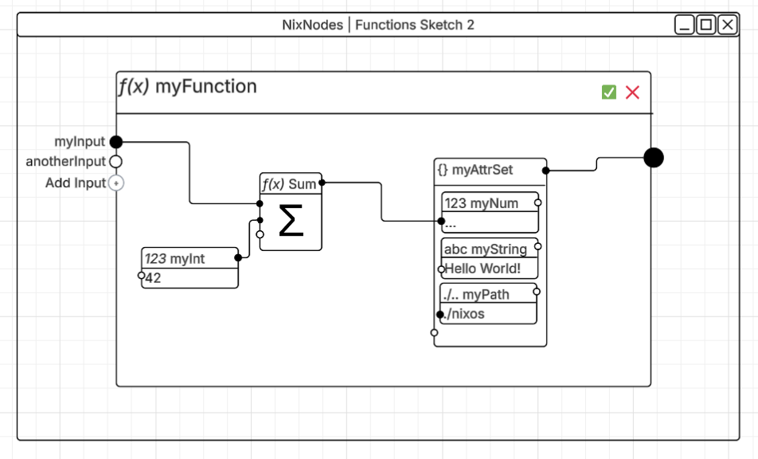
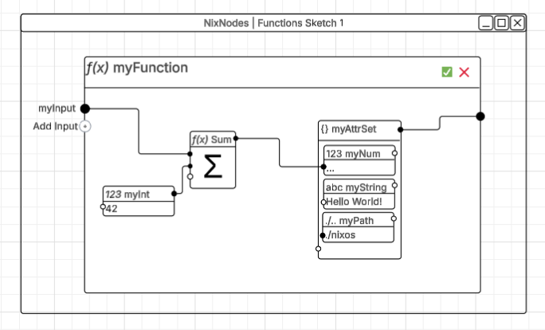
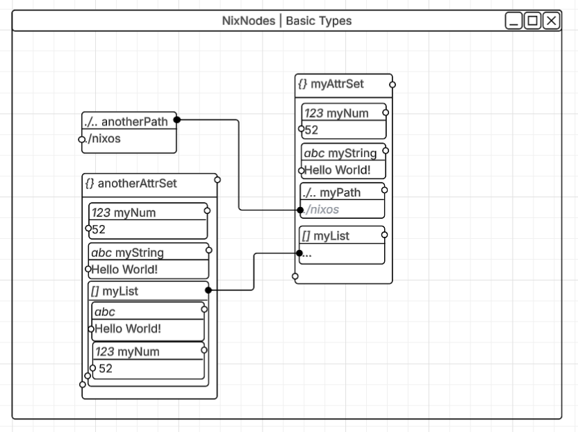

# Nodes Sketches
These are some **Very** preliminary sketches to get an idea of the direction of this programming language

## Function Sketches
<br>
compiles to:
```nix
{ myInput, anotherInput }:
let myInt = 2;
in {
    myNum = myInput + anotherInput + myInt;
    myString = "Hello World!";
    myPath = ./nixos;
}
```
<br>
compiles to:
```nix
myInput:
let myInt = 2;
in {
    myNum = myInput + myInt;
    myString = "Hello World!";
    myPath = ./nixos;
}
```
<br>
compiles to:
```nix
myInput:
let myInt = 2;
in {
    myNum = myInput + myInt;
    myString = "Hello World!";
    myPath = ./nixos;
}
```

## Datatype Sketches
<br>
compiles to:
```nix
anotherPath = ./nixos;
anotherAttrSet = {
  myNum = 52;
  myString = "Hello World!";
  myList = [
    "Hello World!"
    52
  ];
};
myAttrSet = {
  myNum = 52;
  myString = "Hello World!";
  myPath = anotherPath;
  myList = anotherAttrSet.myList
};
```